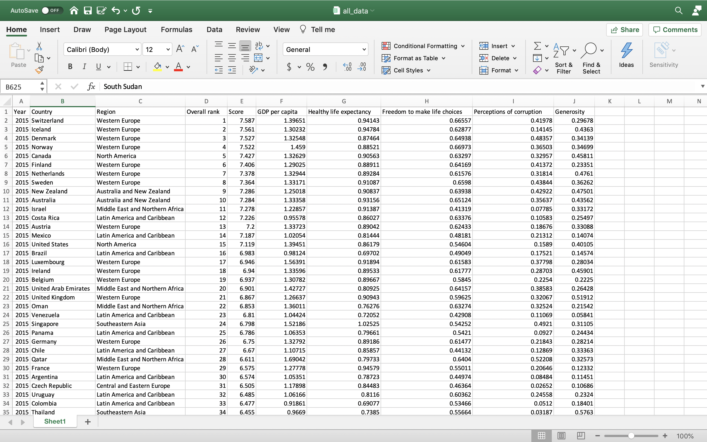
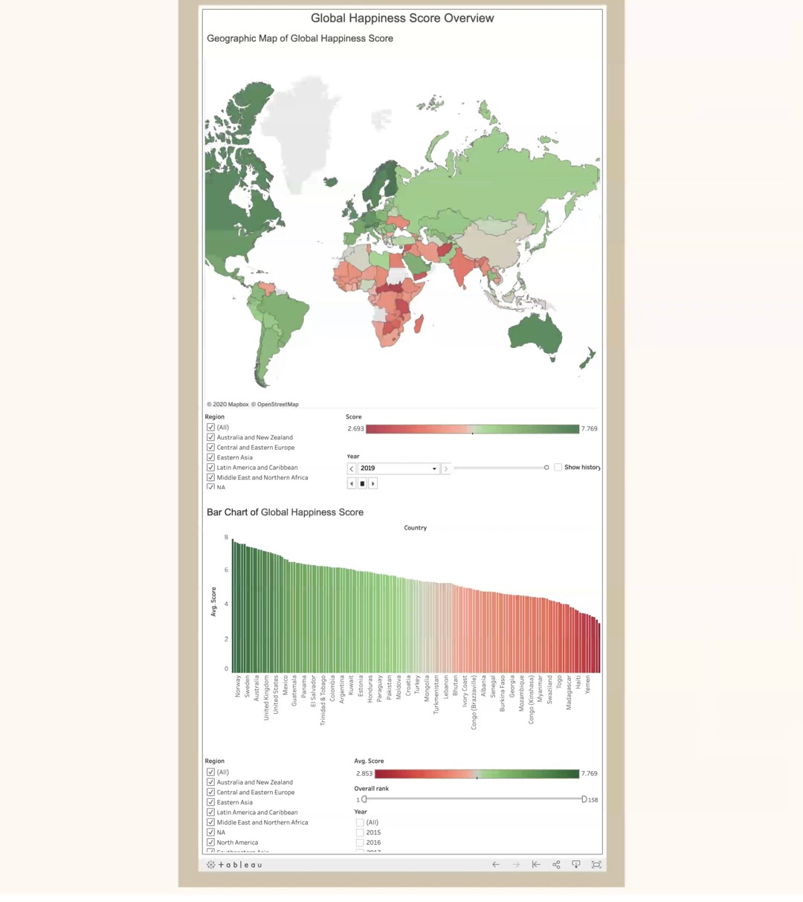
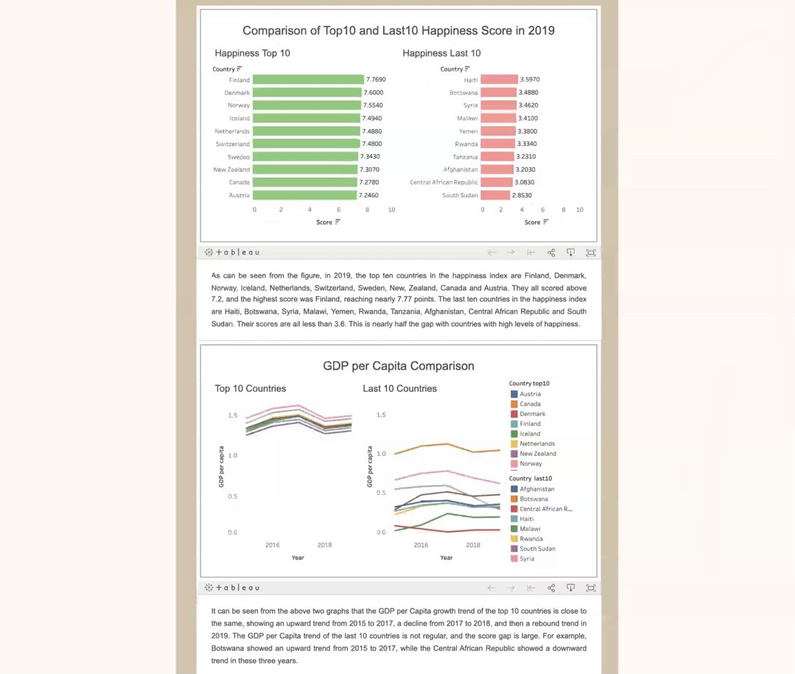
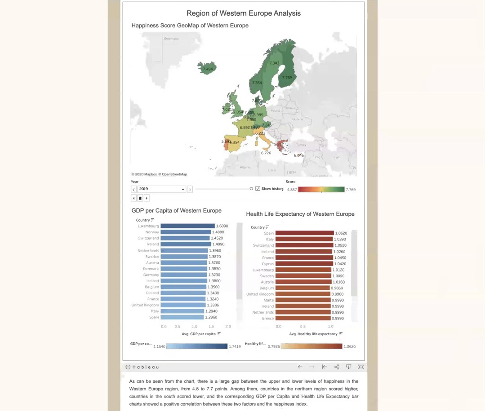

# Visualization of World Happiness Score

This project will use the happiness index reports of more than 150 countries in the five years from 2015 to 2019 to analyze what makes people happy and why a country's happiness index is closely related to national development. 

The main visualization software used in this project is Tableau. Some useful information can be found through the following link：

[Tableau](https://www.tableau.com/why-tableau)

Tableau is a paid software. If users stop the renewal, the dashboard display generated by it will become invalid.

## Data Source 

[World Happiness Report](https://www.kaggle.com/unsdsn/world-happiness?select=2019.csv)

The database for this project comes from the World Happiness Report data set on the Kaggle website. This project will mainly visualize the relationship between GDP per capita, family, life expectancy, freedom, government trust and the happiness score.

## Visualization of Specific Content

- Home Page 

- Factor Page Example 

- Region Page Example

## Conclusion
As can be seen from the chart of happiness index changes of Western Europe, Eastern Asia, Middle East and Northern Africa from 2015 to 2019, there is a certain gap in the happiness index scores of each region. Most countries in the Western Europe region had higher happiness scores, and a small number had lower happiness scores. In Eastern Asia, happiness scores are concentrated on a scale of five to six. In the Middle East and Northern Africa, happiness scores were almost evenly split between high and low. The corresponding GDP per Capita and Health Life Expectancy bar charts show a positive correlation between happiness and the scores of these two factors. Therefore, it can be learned that the happiness in the hearts of the people and he lives in which region of the earth is not too directly related, happiness feelings more mainly depends on the economic level of the living area and the health level of the individual has a great relationship.
